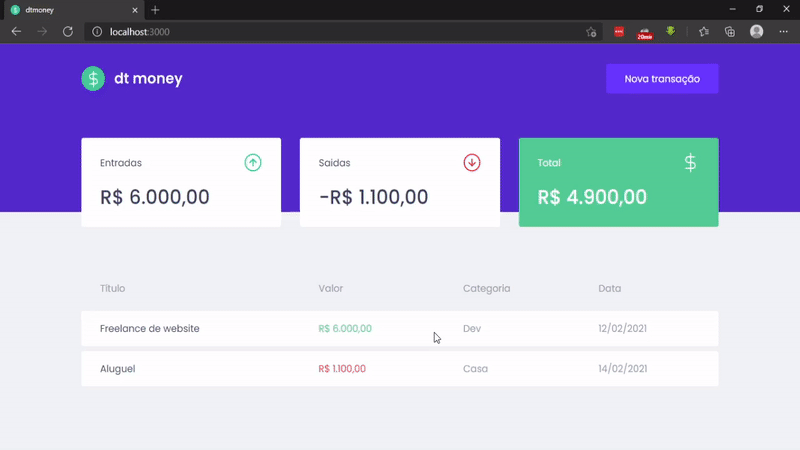

<!-- Logotipo -->
<div align="center">
  
</div>

<!-- Title -->
<h1 align="center"> RocketSeat 🔥 Ignite ReactJS </h1>

<!-- Logo -->
<div align="center">
  
</div>

<!-- Subtitle -->
<h2 align="center"> Módulo 2 - Primeira aplicação web com React ( DT Money ) </h2>

<!-- Preview -->
<div align="center">
  
</div>

<!-- Sobre o Projeto -->
## 🧐 Sobre o Projeto
DT Money é um controle de contas financeiro pessoal que cadastra contas de entrada e saída, totaliza em cards utilizando uma biblioteca de Fake API MirajeJS que utiliza o formato JSON para fazer os cadastros. 

## 🚀 Tecnologias e Bibliotecas
* [ReactJS](#https://pt-br.reactjs.org/tutorial/tutorial.html)
* [Styled Component](#https://www.npmjs.com/package/styled-components)
* [Axios](#https://www.npmjs.com/package/axios)
* [React Modal](#https://www.npmjs.com/package/react-modal)
* [Polished](#https://www.npmjs.com/package/polished)
* [TypeScript](#https://www.typescriptlang.org/)
* [MirageJS](#https://miragejs.com/)

## 💻 Rodando o Projeto
```bash
# Realize o Clone deste repositório
$ git clone https://github.com/lucasbarque/DTMoney.git
# ou use a opção de download.
# Acesse a pasta dtmoney
$ cd DTMoney
# Instale as dependências
$ yarn install
ou
$ npm install
# Executando o Projeto
$ yarn start 
ou
$ npm start
# Acesse http://localhost:3000 no seu navagador
```
© 2022 GitHub, Inc.
Terms
Privacy
Security
Stat